# **E-commerce Sales, Customer, and Seller Performance Analysis**

## **Project Overview**
This analysis investigates key metrics, trends, and performance indicators in an e-commerce dataset, covering product profitability, revenue contributions, payment preferences, customer retention, and seller performance. 

## **Technologies Used**
- **SQL:** Data extraction and transformation.  
- **Python:** Data analysis and correlation checks.  
- **Tableau:** Data visualization for business insights.


## **Key Goals and Questions**
1. [Product Category Performance](#product-category-performance)   
   - Which product categories are the most profitable?  
   - Which categories underperform and require attention?

2. [Product Revenue Contribution and Volume Analysis](#product-revenue-contribution-and-volume-analysis)    
   - What percentage of revenue is generated by the top 20% of products?  
   - Which products generate high revenue but have low order volumes?  

3. [Payment Preferences and Revenue Contribution](#payment-preferences-and-revenue-contribution)    
   - Which payment methods dominate revenue?  
   - How do installment-based payments compare with single payments in terms of value?  

4. [Customer Insights Analysis](#customer-insights-analysis)
   - What is the behavior of one-time buyers vs. returning customers?  
   - Which customers contribute the most to revenue?  
   - Are there seasonal trends in purchases?

5. [Seller Revenue and Geographic Performance](#seller-revenue-and-geographic-performance) 
   - Who are the top-performing sellers by revenue and order count?  
   - Which sellers and regions drive the most significant revenue growth?

---

## **Key Insights and Recommendations**
1) **One-Time Buyers Dominate Short-Term Revenue but Retained Customers Are the Key to Long-Term Growth:**

93% of total revenue comes from one-time buyers, with 93,098 customers making a single purchase. However, retained customers (2,997) generate higher revenue per customer, highlighting their strategic importance.

2) **Top-Performing Product Categories Are Critical for Sustained Profitability:**

Categories like PCs and Computer Accessories consistently deliver high profit margins (exceeding 90%) and substantial revenue contributions.

3) **Pareto Principle in Action:**

Top 25% of products (8,535 out of 32,951) contribute to 75% of total revenue, reinforcing the importance of strategic product focus.

4) **Payment Behavior Patterns Drive Diverse Opportunities:**

Credit cards dominate in terms of total revenue, especially for high-value purchases. However, emerging payment methods like UPI and vouchers show potential for growth among younger and budget-conscious customers.

5) **State-Level Revenue Concentration Creates Geographic Growth Potential:**

São Paulo (SP) is the primary revenue hub, contributing significantly to orders and revenue across years. Emerging regions like BA, RJ, and MG show promise, while underperforming states like PE and SC could benefit from targeted efforts.

6) **High Revenue Products Differ in Volume:**

Categories like Computer Accessories and Electrices 2 achieve high revenue through low order volumes, suggesting high price per order. Conversely, categories like Watches Present and Bed Table Bath rely on high volumes of small orders.

7) **Customer Acquisition Is Strong, but Retention Needs Attention:**

94% of revenue comes from new customers, but their retention rate is low. The top 3 customers alone generate significant revenue annually, demonstrating the impact of high-value customer retention.

8) **Seasonal Trends Offer Tactical Opportunities:**

Peaks in orders during November and December indicate successful holiday campaigns, but a dip in September suggests an opportunity for targeted promotions.


------------------------  
  
  
  
  
  
  # **1. Product Category Performance** <a name="product-category-performance"></a>
 
 ### **Goal:**  
Determine which product categories are the most profitable and which ones underperform.

## **Product Category Performance**
Sales analysis across product categories reveals that certain segments, such as **Bed Table Bath**, **Computer Accessories**, and **Automotive**, dominate revenue contributions. Conversely, categories like **Cine Photo** and **Blu-Ray DVDs** underperform.

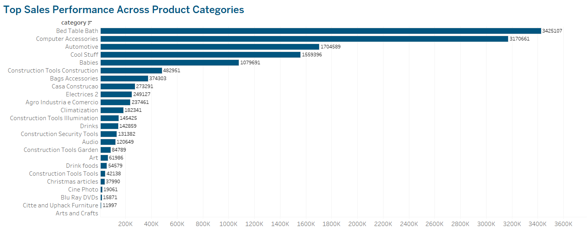

**Recommendation:**  
- Prioritizing high-performing categories for promotions and optimizing underperforming ones through targeted advertising or product re-evaluation could boost revenue.

## **Which product categories have the highest profit margins?**
```sql
SELECT 
    p.product_category_name AS category,
    SUM(order_items.price) AS total_revenue,
    SUM(order_items.freight_value) AS total_shipping_cost,
    SUM(order_items.price) - SUM(order_items.freight_value) AS profit_margin,
    (SUM(order_items.price) - SUM(order_items.freight_value)) / SUM(order_items.price) * 100 AS profit_margin_percentage
FROM 
    order_items 
JOIN 
    products p ON order_items.product_id = p.product_id
GROUP BY 
    p.product_category_name
ORDER BY 
    profit_margin_percentage DESC;
```


## **Profit Margin Thresholds**  
These thresholds were calculated using the 25th, 50th, and 75th percentiles to categorize performance:

- **25th Percentile:** 77.63%  
- **Median (50th Percentile):** 81.54%  
- **75th Percentile:** 85.67%  

---

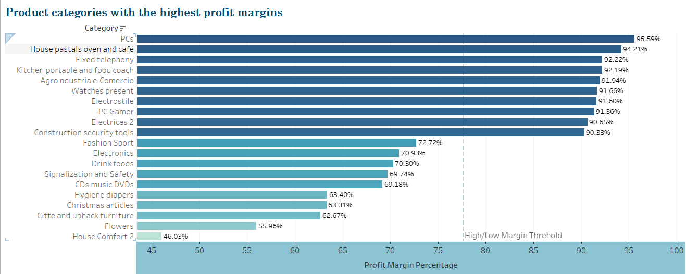

 The visualization above shows the top product categories sorted by their profit margin percentage, with key thresholds displayed for analysis

---

## **✨ Key Insights**
- **Top Performers:** Categories like **PCs**, **House pastals oven and cafe**, and **Fixed telephony** exhibit extremely high profit margins, often exceeding 90%.
- **Potential Targets:** Categories below the 75th percentile need further investigation to improve profitability.
- **Strategic Focus:** Products in the high-margin category can be prioritized for further investment, while low-margin categories can be optimized to reduce costs or improve pricing.


# **2. Product Revenue Contribution and Volume Analysis** <a name="product-revenue-contribution-and-volume-analysis"></a>

### Goal:
Identify the products driving revenue and analyze the impact of order volume and product price.

 ## *What percentage of revenue comes from the top 20% of products (Pareto Principle)?*
  
SQL Query:
```sql
SELECT 
    products.product_id, 
    SUM(order_items.price) AS total_sum, 
    products.product_category_name AS category
FROM 
    order_items
JOIN 
    products ON order_items.product_id = products.product_id
GROUP BY 
    products.product_id, products.product_category_name
ORDER BY 
    total_sum DESC;
```
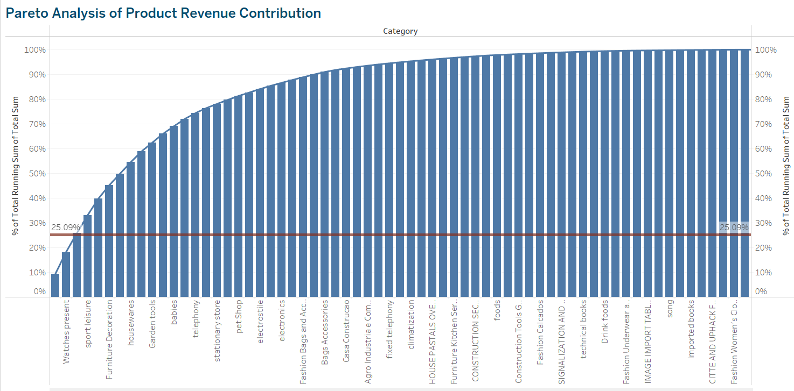
## **Key Insights**
- The top **8,535** products out of **32,951** total products (approximately 25%) contribute to 75% of the total revenue.
- **Revenue Drivers**: This confirms the presence of the **Pareto Principle** within the dataset, meaning that a small fraction of products generates the majority of revenue. The products contributing to this top 20% should be prioritized for marketing, promotions, and strategic investments
- **Optimization Opportunity:** Products making up the remaining 75% of products but only contributing to 25% of revenue could be optimized by either discontinuing underperforming products or adjusting prices and promotions


## **High Revenue, Low Order Volume vs. High Volume, Low Value**

**Comparoson:**  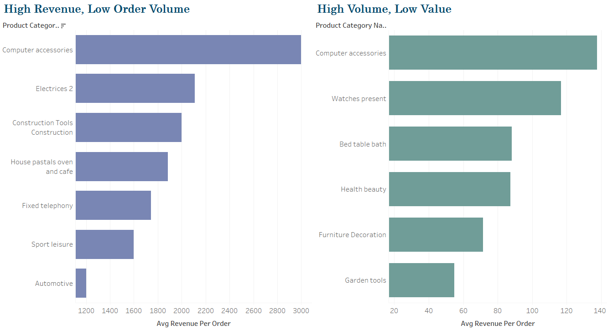

## **✨ Key Insights**
High Revenue, Low Order Volume:
- Categories like **Computer Accessories**, **Electrices 2**, and **Construction Tools** generate significant revenue despite relatively low order volumes.
- This indicates that these products have high average revenue per order, likely due to higher unit prices or bulk purchases.

High Volume, Low Value:
- Categories such as **Watches Present**, **Bed Table Bath**, and **Health Beauty** have high order volumes but low revenue per order.
- These products may be lower in price or involve frequent small purchases, indicating a volume-driven revenue strategy.

# **Statewise Analysis Based on Payments**

### **Goal:**  
Understand how payment activity is distributed across different states and over time.


## **States Per Year Based on Total Payments**


## **✨ Key Insights**
- **Dominant States:** The state of **SP** consistently shows the highest total payment volume across all years, followed by other key states like **MG**and **RJ**.
- **Yearly Trends:** Across multiple states, there is a noticeable increase in total payment volume from 2016 to 2018, reflecting either business expansion or increased customer activity in key regions.


# **4. Payment Preferences and Revenue Contribution** <a name="payment-preferences-and-revenue-contribution"></a>

sql
```
SELECT 
    payment_type, 
    COUNT(payment_type) AS payments_count,
    SUM(payment_value) AS total_payment_value
FROM payments
GROUP BY payment_type
ORDER BY total_payment_value
```
## **✨ Key Insights**
- **Credit Cards Dominate:** based on visualization, credit cards are not only preferred for everyday purchases but also for high-ticket transactions, possibly due to features like higher spending limits and reward programs

- **UPI: Fast-Growing Contender with Moderate Value** a rising star, driven by mobile and digital adoption. However, UPI’s contribution to value per transaction is moderate, indicating that it is frequently used for low to mid-value purchases. This pattern might be linked to its **popularity among younger** users for smaller purchases

- **Vouchers: High Volume but Limited Value**, accounting for 11,550 transactions but generate only 0.76 million in revenue. The gap between transaction count and revenue contribution could indicate that voucher users primarily focus on savings, for smaller purchases or redemptions.

- **Debit Cards: Limited Contribution, Underperforming Potential**, only 3,058 transactions and a total payment value of 0.43 million. This may suggest that debit card users have a conservative spending pattern, possibly due to limited account balances or lack of perks compared to credit cards.

 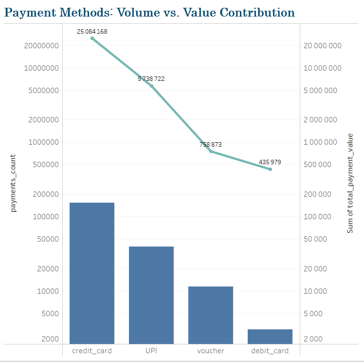

 ## **Installment Correlation Analysis**
```python
# correlation and scatter plot
installments_comparison = installments_comparison[(installments_comparison['total_payment_value'] > 0) & (installments_comparison['payment_installments'] > 0)]
correlation = installments_comparison['total_payment_value'].corr(installments_comparison['payment_installments'])
print(f"Correlation between total payment value and payment installments: {correlation:.2f}")

plt.figure(figsize=(8, 6))
sns.scatterplot(data=installments_comparison, x='payment_installments', y='total_payment_value', alpha=0.5)
plt.title('Scatter Plot of Payment Value vs. Installments')
plt.xlabel('Payment Installments')
plt.ylabel('Payment Value')
plt.show()
```

**Scatter Plot:**  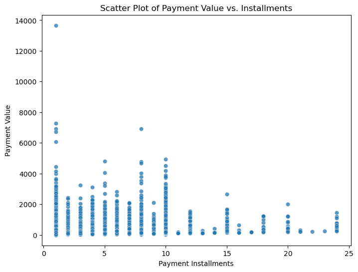
---

## **✨ Key Insights**
- **Installment Preference:** A significant number of high-value payments are made in installments, as evidenced by the larger total payment volume for installment payments compared to single payments.
- **Weak Correlation:** Despite the high total installment payment volume, the correlation analysis shows that there is **no strong linear relationship** between the number of installments and payment value.

---

 # **4. Customer Insights Analysis** <a name="customer-insights-analysis"></a>

### **Steady Growth in Orders**
The number of orders steadily increased between 2017 and 2018, showcasing effective customer acquisition strategies. The growth suggests that the company has been successful in expanding its reach and attracting new customers. However, the limited data for 2016 influence interpreting overall growth trend.

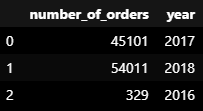

---

### **High-Value Customers Drive Sustained Revenue**
```sql
-- Query to identify the top 3 customers by revenue in each year
query = """
SELECT years, customer_id, payment, d_rank
FROM
(
    SELECT 
        YEAR(orders.order_purchase_timestamp) AS years,
        orders.customer_id,
        SUM(payments.payment_value) AS payment,
        DENSE_RANK() OVER (PARTITION BY YEAR(orders.order_purchase_timestamp)
                           ORDER BY SUM(payments.payment_value) DESC) AS d_rank
    FROM orders 
    JOIN payments ON payments.order_id = orders.order_id
    GROUP BY years, orders.customer_id
) AS a
WHERE d_rank <= 3;
"""
```
### **✨ Key Insights**
- The top 3 customers alone generated substantial revenue, indicating that personalized engagement and retention efforts for these customers could yield further benefits. Their behavior over time suggests that maintaining strong relationships with them is critical to sustaining high revenue levels.

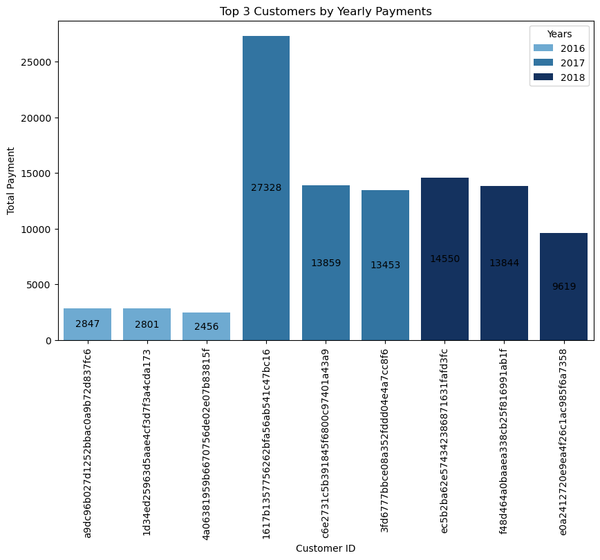
---

### **How many customers stop purchasing after their first order?**

- **94%** of the revenue coming from **new customers**, this highlights the company’s strong customer acquisition efforts. However, this also suggests an opportunity to enhance retention strategies, as **returning customers** contributed only **6%** of total revenue.

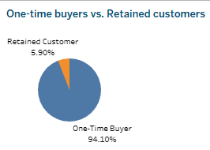

**Recommendation:**  
- Given that 93,098 customers are one-time buyers, creating targeted post-purchase engagement campaigns and offering loyalty rewards to encourage repeat purchases. Personalized follow-up marketing via email, personalized product recommendations, and special discount offers can effectively convert these one-time buyers

---

### **What is contribution to the revenue One-Time Buyers vs Returning customers?**

```sql
-- query calculates customer segmentation by categorizing customers as either 
--'One-Time Buyer' or 'Retained Customer' based on their order count. 
-- and aggregates metrics, such as customer count, total revenue, and average orders per customer.
query = """
SELECT 
    CASE 
        WHEN order_count = 1 THEN 'One-Time Buyer'
        ELSE 'Retained Customer'
    END AS customer_type,
    COUNT(customer_unique_id) AS customer_count,
    SUM(total_payment) AS total_revenue,
    AVG(order_count) AS avg_orders_per_customer
FROM (
    SELECT 
        customers.customer_unique_id,
        COUNT(DISTINCT orders.order_id) AS order_count,
        SUM(payments.payment_value) AS total_payment
    FROM customers
    JOIN orders ON customers.customer_id = orders.customer_id
    JOIN payments ON orders.order_id = payments.order_id
    GROUP BY customers.customer_unique_id
) AS customer_summary
GROUP BY customer_type;
"""
```
A majority of customers **(93,098)** were one-time buyers, accounting for most of the revenue. However, retained customers **(2,997)** displayed higher revenue per customer, making them more valuable in the long run.

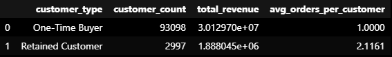

**Recommendation:**  
- Converting one-time buyers into loyal, repeat customers through follow-up marketing, incentives, and post-purchase engagement could substantially increase overall revenue stability.

---

### **Are there seasonal trends in purchases?**
The seasonal trend analysis indicates consistent growth in purchases throughout the year, with noticeable spikes during **November** and **December**, possibly due to holiday promotions or end-of-year sales. September showed a dip, suggesting this period may benefit from promotional campaigns to stimulate demand.


---


# **5. Seller Revenue and Geographic Performance** <a name="seller-revenue-and-geographic-performance"></a>

```
SELECT 
    sellers.seller_id, 
    sellers.seller_state, 
    COUNT(orders.order_id) AS total_orders, 
    SUM(order_items.price) AS total_revenue 
FROM 
    order_items
JOIN 
    orders ON order_items.order_id = orders.order_id
JOIN 
    sellers ON order_items.seller_id = sellers.seller_id
GROUP BY 
    sellers.seller_id, sellers.seller_state
ORDER BY 
    total_revenue DESC
LIMIT 55;
```

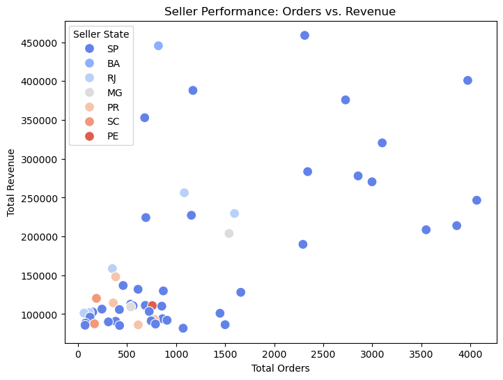

## **✨ Key Insights**
- **SP (São Paulo) Dominates:** Most top-performing sellers by orders and revenue are located in SP, making it a critical business hub

**High Revenue, Low Orders:**
- Some sellers generate significant revenue with relatively few orders, likely due to high-ticket items or premium products

**High Orders, Low Revenue:**
- Sellers handling large volumes but generating low revenue likely focus on low-margin products, suggesting room for optimization

**Emerging Regions:**
- States like **BA**, **RJ**, and **MG** show potential, but regions like **PE** and **SC** could benefit from targeted growth strategies